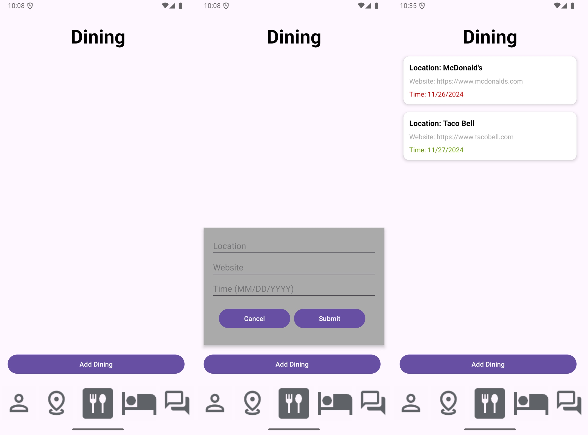

WanderSync is simplifies the process of creating and managing travel itineraries for solo and group travel. 
Through this app, users can contribute to and refine travel plans in real-time. 
The Travel Management app allows users to organize locations, transportation options, accommodations, dining reservations, and personal notes. 
Key features include secure account creation, a user-friendly interface for itinerary management, and real-time collaboration tools for group planning. 
Users can seamlessly integrate travel details such as destinations, transportation schedules, lodging information, and dining preferences. 
The app also offers features for adding and sharing notes, creating shared travel agendas, and synchronizing updates among all group members.  

We will introduce the main features of WanderSync and the design of each 
feature. 
To implement features, we will use Firebase Realtime Database to store
all the data. More specifically, we will have five databases:
[UserDatabase](app/src/main/java/com/example/sprint1/model/UserDatabase.java), 
[DestDatabase](app/src/main/java/com/example/sprint1/model/DestDatabase.java),
[DiniDatabase](app/src/main/java/com/example/sprint1/model/DiniDatabase.java),
[AccoDatabase](app/src/main/java/com/example/sprint1/model/AccoDatabase.java),
and
[TravDatabase](app/src/main/java/com/example/sprint1/model/TravDatabase.java).

## Sign In and Sign Up

After launching the app with a welcome page, users can sign in or sign up. 
For sign up, after a user enters a username and password, the app will create a new user in the [UserDatabase](app/src/main/java/com/example/sprint1/model/UserDatabase.java). 
The key is just the username, and the values are username and password. Note that we will have more values in the future. 
For sign in, the app will check if [UserDatabase](app/src/main/java/com/example/sprint1/model/UserDatabase.java) has the entered username as a key and if the entered password is the same as the password stored under the username. 

```json
{
  "user": {
    "tianrui": {
      "password": "123",
      "username": "tianrui"
    }
  }
}
```


## Add Dining

In the Dining page, users can add a new dining place by clicking the `Add Dining` button and entering required fields.
After users click the `Submit` button, in [DiniDatabase](app/src/main/java/com/example/sprint1/model/DiniDatabase.java), the app will randomly generate a key for this dining place and store each field as a value.
Then, the app will add this dining key generated to the user's dining list in [UserDatabase](app/src/main/java/com/example/sprint1/model/UserDatabase.java).
After the interaction with the database finishes, the app will refresh the dining page and list all the dining places stored under the user's dining list.
The app marks the date that is later than today as green where others as red and sorts the list by date.

```json
{
  "dining": {
    "-OCd0Lh6Clt2BCKIf2mM": {
      "location": "McDonald's",
      "time": "11/26/2024",
      "website": "https://www.mcdonalds.com"
    },
    "-OCd0nH7yeCiFlE2dUoK": {
      "location": "Taco Bell",
      "time": "11/27/2024",
      "website": "https://www.tacobell.com"
    }
  },
  "user": {
    "tianrui": {
      "dining": [
        "-OCd0Lh6Clt2BCKIf2mM",
        "-OCd0nH7yeCiFlE2dUoK"
      ]
    }
  }
}
```



## Add Accommodation

In the Accommodation page, user can add a new accommodation by clicking the `Add Accommodation` button and entering required fields.
After clicking the `Submit` button, the app will generate a key for this accommodation and store each field as a value in [AccoDatabase](app/src/main/java/com/example/sprint1/model/AccoDatabase.java).
Then, the app will add this accommodation key generated to the user's accommodation list in [UserDatabase](app/src/main/java/com/example/sprint1/model/UserDatabase.java).
After the interaction with the database finishes, the app will refresh the accommodation page and list all the accommodations stored under the user's accommodation list.
The app marks the date that is later than today as green where others as red and sorts the list by date.

```json
{
  "accommodation": {
    "-OCd55NK_O4EU_VdJR6_": {
      "checkIn": "11/24/2024",
      "checkOut": "11/27/2024",
      "location": "QQQQ",
      "roomNum": "1",
      "roomType": "Two"
    },
    "-OCd5BdyNzdt_ggxQmqo": {
      "checkIn": "11/28/2024",
      "checkOut": "11/30/2024",
      "location": "WWWW",
      "roomNum": "2",
      "roomType": "One"
    }
  },
  "user": {
    "tianrui": {
      "accommodation": [
        "-OCd55NK_O4EU_VdJR6_",
        "-OCd5BdyNzdt_ggxQmqo"
      ]
    }
  }
}
```


## Add Travel Post

In the Travel Community page, users can add a new travel post by clicking the `Add Travel Post` button and entering required fields.
After clicking the `Submit` button, the app will generate a key for this travel post and store each field as a value in [TravDatabase](app/src/main/java/com/example/sprint1/model/TravDatabase.java).
Differ from the previous two features, the app will also store the username as a value of the travel post since we want to know who created this travel post.
Then, the app will add this travel post key generated to the user's travel post list in [UserDatabase](app/src/main/java/com/example/sprint1/model/UserDatabase.java).
After interaction with the database finishes, the app will refresh the travel page and list all the travel posts stored under the [TravDatabase](app/src/main/java/com/example/sprint1/model/TravDatabase.java).
This is also why we have to store username as a value of each post since this page will display all the post instead of the travel post list of the current user.

```json
{
  "travel": {
    "-OCd7jyda-tQciqfa-xG": {
      "accommodation": "QQQQ is bad.",
      "destination": "Atlanta",
      "dining": "McDonald's is good.",
      "end": "11/29/2024",
      "note": "All the best.",
      "start": "11/24/2024",
      "username": "tianrui"
    },
    "-OCd7vJzj8SjCWF5TWMV": {
      "accommodation": "QQQQ is bad.",
      "destination": "New York",
      "dining": "Taco Bell is good.",
      "end": "11/30/2024",
      "note": "All the worst.",
      "start": "11/25/2024",
      "username": "tianrui"
    }
  },
  "user": {
    "tianrui": {
      "travel": [
        "-OCd7jyda-tQciqfa-xG",
        "-OCd7vJzj8SjCWF5TWMV"
      ]
    }
  }
}
```


## Add Destination

In the Destination page, users can add a new destination by clicking the `Add Destination` button and entering required fields.
After clicking the `Submit` button, the app will generate a key for this destination and store each field as a value in [DestDatabase](app/src/main/java/com/example/sprint1/model/DestDatabase.java).
Then, the app will add this destination key generated to the user's destination list in [UserDatabase](app/src/main/java/com/example/sprint1/model/UserDatabase.java).
After the interaction with the database finishes, the app will refresh the destination page and list all the destinations stored under the user's destination list.

```json
{
  "destination": {
    "-OCdCmreVTltnX7fVXFT": {
      "duration": "6",
      "endDate": "11/10/2024",
      "startDate": "11/05/2024",
      "travelLocation": "New York"
    },
    "-OCdCquI8Fmi_gefxn4S": {
      "duration": "11",
      "endDate": "11/08/2024",
      "startDate": "10/29/2024",
      "travelLocation": "Atlanta"
    }
  },
  "user": {
    "tianrui": {
      "destination": [
        "-OCdCmreVTltnX7fVXFT",
        "-OCdCquI8Fmi_gefxn4S"
      ]
    }
  }
}
```


## Calculate Vacation Time

In the Destination screen, user can calculate the vacation time by entering two of the three fields: start date, end date, and duration.
After clicking the `Calculate` button, the app will calculate the third field and store these fields under [UserDatabase](app/src/main/java/com/example/sprint1/model/UserDatabase.java) since we will use this information later. 
Next, the app will calculate days that are planned, i.e., added as a destination, during this period of vacation time and display the result.

```json
{
  "user": {
    "tianrui": {
      "vacation": {
        "duration": "30",
        "endDate": "11/30/2024",
        "startDate": "11/01/2024"
      }
    }
  }
}
```

In the Logistics page, there is a visualization button that will display the allotted vs planned trip days in a pie chart.
This is also why we store the vacation time previously since we need to calculate the days that are planned during this period again when displaying the pie chart.


